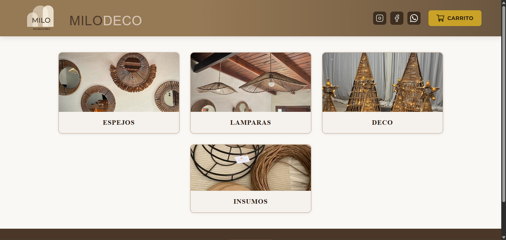
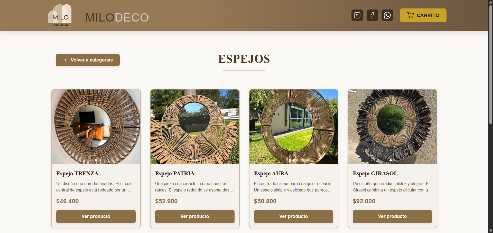
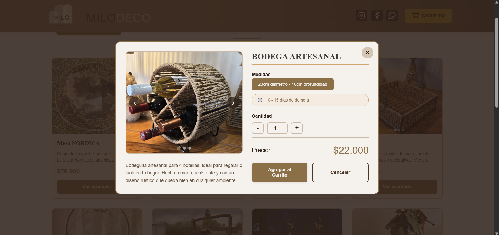

# Milodeco Web

Sitio web oficial de Milodeco para exhibir su catálogo de productos artesanales, facilitar el contacto directo con la emprendedora y acompañar el proceso de compra de forma simple y cercana

Está orientado a potenciales clientes que quieren explorar productos de decoración hechos a mano, consultar variantes y continuar la compra por WhatsApp.

## Demo

- Link: https://milodeco.netlify.app/

## Capturas

## Tecnologías utilizadas

- HTML5
- CSS3 (estilos modularizados por secciones)
- JavaScript Vanilla (ES6+)
- JSON para fuente de datos del catálogo (stock.json)
- Web APIs del navegador:
  - Fetch API
  - LocalStorage
  - DOM API
- Google Fonts (tipografías)
- Google Analytics (gtag.js)

## Funcionalidades

- Catálogo dinámico por categorías cargado desde stock.json.
- Vista de productos por categoría con tarjetas e imágenes.
- Carruseles de imágenes en tarjetas y en detalle de producto.
- Modal de producto con selección de medidas, cantidad y cálculo de precio en tiempo real.
- Lógica específica para productos con variaciones complejas (ejemplo: Papel Kraft por color, grosor y metros).
- Carrito de compras con persistencia local mediante LocalStorage.
- Edición rápida del carrito (eliminar ítems, ver total, mantener nombre del cliente).
- Generación automática de mensaje de compra y redirección a WhatsApp.
- Sección Sobre Mí con contenido audiovisual y navegación de videos.
- Enlaces directos a redes sociales y ubicación.
- Diseño responsive y experiencia visual orientada a catálogo.

## Decisiones técnicas

- Se eligió HTML, CSS y JavaScript puro para mantener una solución liviana, directa de desplegar y adecuada al alcance del cliente.
- El catálogo se desacopló en un archivo JSON para facilitar mantenimiento de productos sin cambiar estructura HTML.
- La interfaz está separada por módulos de estilo (header, productos, modales, footer, etc.) para mejorar orden y escalabilidad.
- La lógica de carrito y selección de variantes se resolvió en cliente para priorizar inmediatez y simplicidad operativa.
- Se integró WhatsApp como canal de cierre comercial para mantener contacto personalizado con la emprendedora.

## Estado del proyecto

En uso real por la marca Milodeco y funcional para su objetivo principal (catálogo + contacto comercial). Actualmente puede considerarse en mejora continua, con base estable en producción

## Autor

- Nombre: Esteban Granja
- Rol: Desarrollador Frontend
- LinkedIn: linkedin.com/in/estebangranja/
- Email: tebygranja@gmail.com